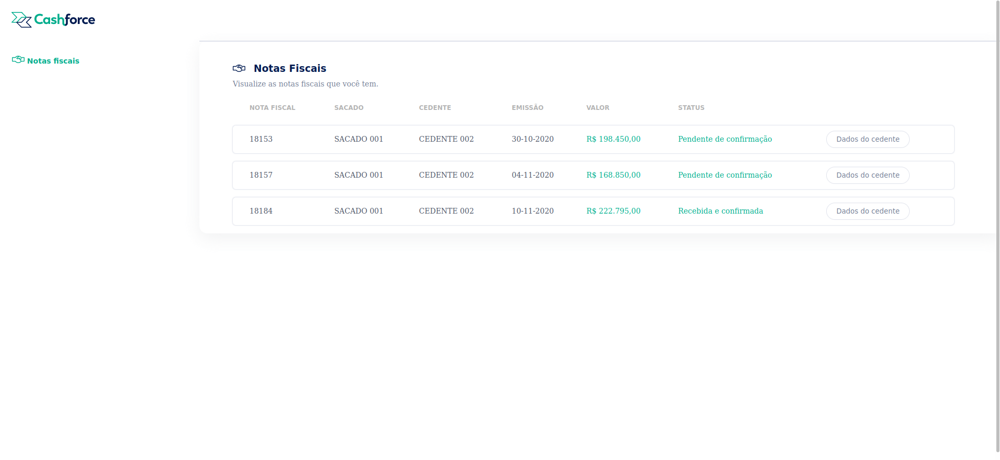

# desafio-cashforce-fullstack

Esse projeto foi desenvolvido para um teste técnico!
O desafio foi desenvolver uma aplicação fullstack onde o backend alimentava o banco de dados MySQL com informações referentes a nota fiscais de um usuário, renderizando assim, essas informações no frontend através do framework VueJS.

Aqui você vai encontrar os detalhes de como foi o desenvolvimento do projeto e quais foram os requisitos técnicos necessários para a entrega do desafio.

#Descrição:
Aplicação Fullstack onde é possivel acessar todas notas fiscais referentes ao usuário.

# Habilidades desenvolvidas

Neste projeto, fui capaz de:

- Utilizar o banco de dados relacional MySQL;
- Utilizar o ORM Sequelize para trabalhar com o banco de dados MySQL;
- Construir uma API CRUD com Node.js e Express;
- Criar rotas para uma API com Express;
- Desenvolver Testes de Integração no backend;
- Estilizar uma página web com CSS;
- Desenvolver aplicação Frontend com Vue.JS;
   
---

# Funcionamento da aplicação

Para iniciar o projeto, é necessário possuir o [Docker](https://docs.docker.com/engine/install/ubuntu/) instalado.

⚠ **Atenção:** ⚠
- Todos os seguintes comandos devem ser realizados na RAIZ DO PROJETO.

**Instalação de dependências na raiz do projeto:** 

```
npm run postinstall
```

**Utilizando o docker**

```
docker-compose up
```


Após isso, você pode acessar a aplicação através do endereço http://localhost:8080/.

# Sobre os testes
## Executando todos os testes

Para poder executar os testes, na raiz, utilize o comando o comando `npm run pretest` e **todos** os seus testes serão executado.

---

<p align="center">

</p>

## 📚 Documentação (endpoints BACKEND)


### 👨🏻‍🦱 Página Principal
| Método | Funcionalidade                            | URL                        |
| ------ | ----------------------------------------- | -------------------------- |
| `GET`  | Busca todas as informações referente a nota fiscal do usuário. | http://localhost:8080/ |

<details>
  <summary>A resposta da requisição é a seguinte, com status 200:</summary>

```json
[
  {
    "id": 1,
    "nNf": "18153",
    "emissionDate": "2020-10-30T11:00:00-03:00",
    "value": "198450",
    "orderStatusBuyer": "0",
    "buyer": {
      "name": "SACADO 001"
    },
    "provider": {
      "name": "CEDENTE 002",
      "tradingName": "CEDENTE 002 LTDA",
      "cnpj": {
        "number": "00000000000002"
      }
    }
  },
  {
    "id": 2,
    "nNf": "18157",
    "emissionDate": "2020-11-04T15 :32:35-02:00",
    "value": "168850",
    "orderStatusBuyer": "0",
    "buyer": {
      "name": "SACADO 001"
    },
    "provider": {
      "name": "CEDENTE 002",
      "tradingName": "CEDENTE 002 LTDA",
      "cnpj": {
        "number": "00000000000002"
      }
    }
  },
  {
    "id": 3,
    "nNf": "18184",
    "emissionDate": "2020-11-10",
    "value": "222795",
    "orderStatusBuyer": "7",
    "buyer": {
      "name": "SACADO 001"
    },
    "provider": {
      "name": "CEDENTE 002",
      "tradingName": "CEDENTE 002 LTDA",
      "cnpj": {
        "number": "00000000000002"
      }
    }
  }
]
```

</details>
<br>
<br>
